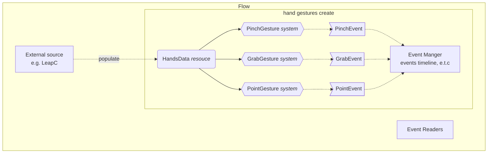

```mermaid
flowchart
    subgraph "`Flow`"
        direction LR
        A[External source\ne.g. LeapC] -..->|populate| B("`HandsData _resouce_`" )
        subgraph graph1[hand gestures create]
            direction TB
            B --> C{{"`PinchGesture _system_ `"}} -.-> F>PinchEvent]
            B --> D{{"`GrabGesture _system_ `"}} -.-> G>GrabEvent]
            B --> E{{"`PointGesture _system_ `"}} -.-> H>PointEvent]
            F -.-> I[Event Manger\n events timeline, e.t.c]
            G -.-> I
            H -.-> I
        end
        J[Event Readers]
    end

```
